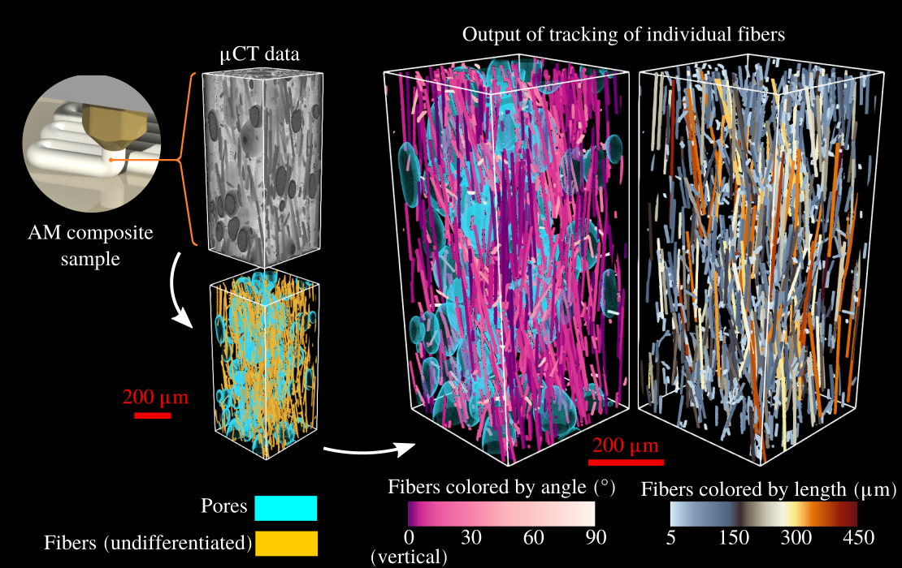
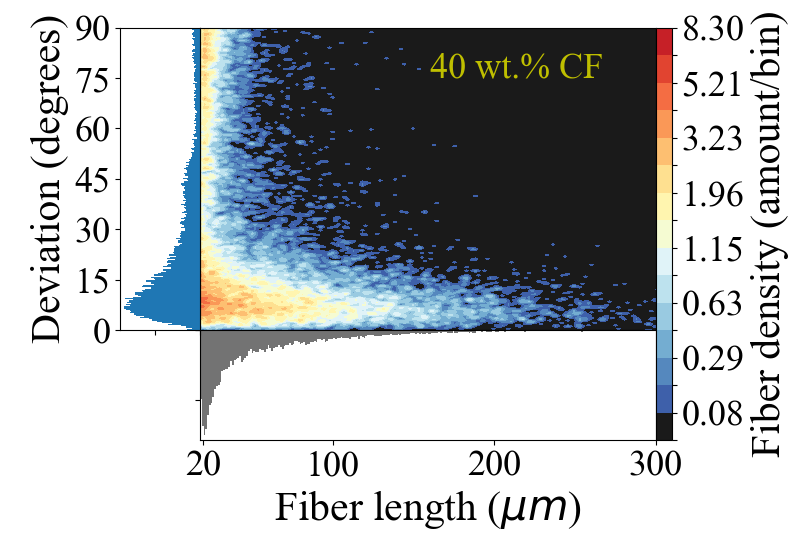

# OpenFiberSeg
Automated segmentation tool for the extraction of individual fibers in short fiber reinforced composites. This project is under active development, please check for changes periodically. 

## Install python packages

This project has been tested on Python 3.7 and 3.8, on Linux and Windows. The packages and recommended versions are found in the requirements.txt . If those packages conflict with your installation, consider using this project in it's own environment. 

(the following notation indicates running a command in terminal)
$ <command>

Install requirements:

$ python3 -m pip install -r requirements.txt

On Linux, if installing opencv-python with the above command fails, you may need to build OpenCV from source. Please see: https://docs.opencv.org/4.5.3/d7/d9f/tutorial_linux_install.html

# Run extraction on the sample data provided

## Pull datasets from remote repository

In order to keep the main repository (this one) lightweight, the 14Gb of data were put in a separate repository, to allow users to pull it only if needed. 

$ python3 getRemoteData.py

## Pre-process sample data set: PEEK 5 wt.%CF

The parameters for pre-processing of all data sets are in the file preProcessing.py. Executing as-is will process PEEK05 sub-folder. Un-comment another line from 53-60 to select another data folder. 

$ python3 preProcessing.py

## Pre-segmentation with Insegt

Run script InsegtFiber_3D.m in Matlab (tested on R2016b, R2018a,R2018b). Again, the sub folder with PEEK05 is pre-selected, and will be processed if the file is run as-is. Un-comment another line from 35-41 to select another data folder than PEEK05. The output of Insegt will be in a folder with the ranges in x, y and z in the folder name, in a second folder with the date and time, so they are not over-written if Insegt is run again with different parameters. By default, this code will run across multiple workers. This uses a large amount of RAM. Manually set the variable nPool to 1 or 2 to reduce RAM requirements.  

To use compression available in python, but not matlab, and save on disk space, the compressTiff.py script is called from InsegtFiber_3D.m. However, the command on line 469 may require modification to suit your installation of python. 

## Processing

Script main.py finds datasets processed with Insegt, but haven't been tracked, and processes them sequentially. 

$ python3 main.py

For each subfolder identified by main.py, the entire processing will be attempted. If it is interrupted for some reason, relaunching main.py will start from the last completed steps. For each dataset, once the processing is completed, files fiberStruct_final.pickle and PropertyMaps.vtk are generated. The file PropertyMaps.vtk can be visualized with Paraview. The deviation and length information is encoded in different fields.

If the 3D renderings are not required, variables randomizeFiberMap and makeVTKfiles can be set to False in the main.py file. This will make the final step much faster. fiberStatistics.py will still work, using fiberStruct_final.pickle. 

## Plotting results

Extract fiber statistics and plot results as shown in the journal publication by indicating the correct path on line 29 of fiberStatistics.py. 

example path:
path="./TomographicData/PEEK05/processed_x1-901_y1-871_z1-978/2020-01-01_12h00m00/"

then run:

$ python3 fiberStatistics.py

# Working with your own tomographic data

Basic usage tutorial is explained at: https://www.youtube.com/watch?v=wSJxrktZU4o

Place the tiff files of your scans in their own path in:
./TomographicData/\<Scan Name\>/uCT_RawData

To find the pre-processing parameters, run the GUI application and follow instructions in:

$ python3 preProcessing_GUI.py

Beware the GUI is still in beta, not all features are functional. 

Parameters can also be controlled manually by creating a new case in the preProcessing.py script.

To create a new dictionary to work with Insegt, use the script called InsegtFiber_3D_createDictionary.m in Matlab. We refer you to the documentation on Insegt from the creators of this tool, at http://qim.compute.dtu.dk/tools/#interactive-segmentation-tool-insegt 

Create a new case in InsegtFiber_3D.m to point to your data directory, along with pixel ranges and path to dictionary. 

In the main.py file, change the dataPath variable to the directory containing "processed" files from Insegt. Launch this script to execute OpenFiberSeg with default parameters. On first run, main.py will create a trackingParams.json file, containing the default parameters. Editing parameters in this json file enables the use of different parameters for this particular dataset, without changing the default parameters.

Once OpenFiberSeg completes, fiber statistics and figures such as those published in the original paper can be created from the script fiberStatistics.py. Change the "path" variable in this script to the directory containing your data (specifically, the directory containing the "fiberStruct_final.pickle" file produced by OpenFiberSeg). The following graphs is created using the PEEK40 dataset provided along with this repo.

